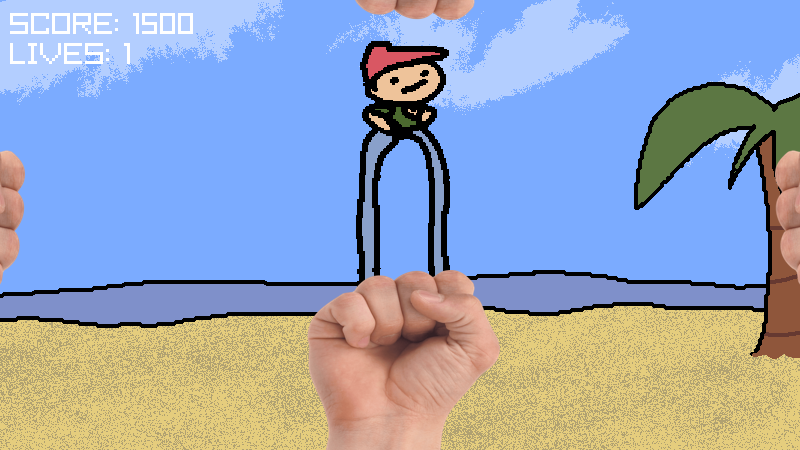
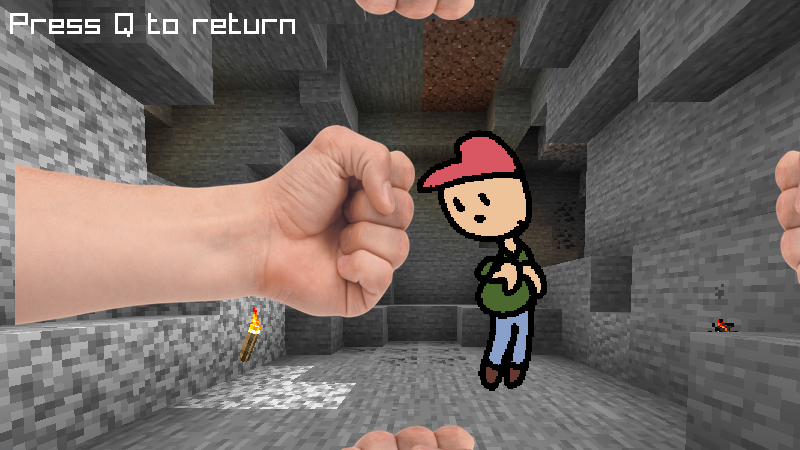
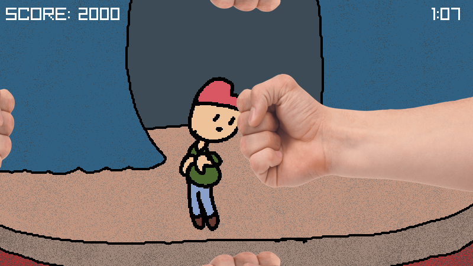

# Fistbump'd
WARNING: you may see messy code over here. Don't get salty!

## Screenshots

## Building and playing
I'd recommend building for web since the desktop version sucks (no savefiles, jeez!) + if you're a Windows/Mac/Pi user, you most likely wouldn't be able to compile it!

Create a directory called `build`. Inside `build`, create another called `web`.

Get the emscripten toolchain (emcc, emrun), run `make run PLATFORM=WEB` and the game should pop up on your browser.
